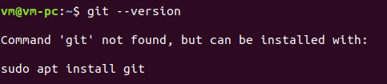
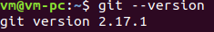
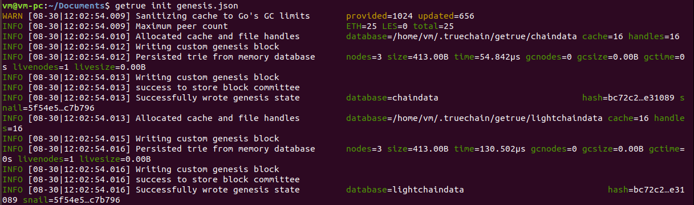
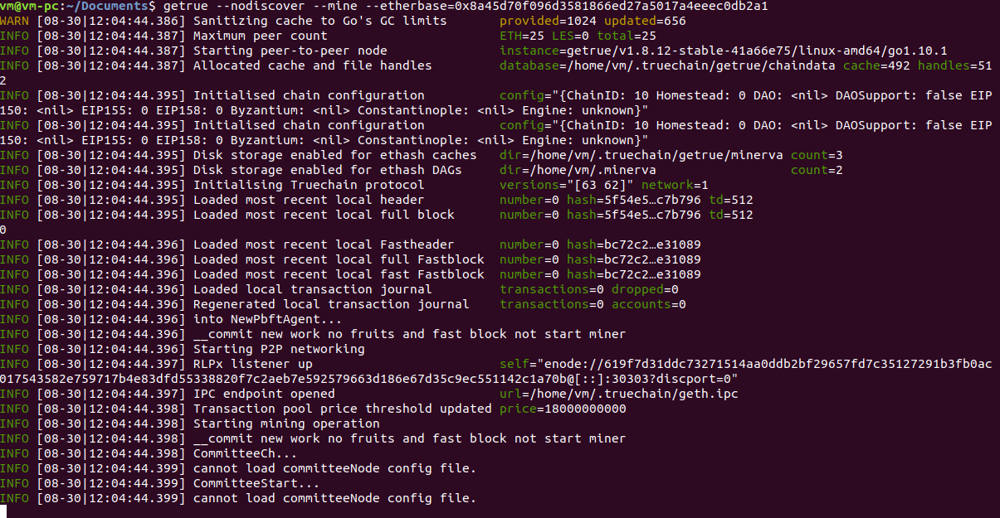
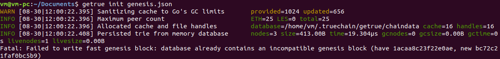

# True链开发准备篇-环境搭建（Ubuntu）
###### 作者：程阳	审阅：rectinajh

## 系统版本： Ubuntu 18.04
**注：**
**1. 不同Linux发布版本安装过略有所不同，CentOS，RHEL 安装过程中使用“yum”代替“apt-get”。**
**2. 本教程中演示的Ubuntu版本比较新，低版本的Ubuntu安装过程中的输出可能会稍有不同**

## 所需工具
1. Git
2. Go => version 1.7 或更高版本
3. 编译工具

## 安装Git
首先，检查系统是否以经安装了git

```
$ git --version
```


当出现类似上图时，表示系统未安装git

然后，由于对Git的版本要求不高，所以直接使用包管理工具安装
```
$ sudo apt-get install git
```

最后，安装完成后，检查是否安装成功
```
$ git --version
```


当出现类似上图时，表示系统安装git成功

## 安装Go
首先，同样是检查是否已经安装了go
```
$ go version
```
未安装时，有三种方式安装：使用包管理工具安装，使用官方发布的安装包安装和使用源码安装。使用包管理工具安装是最方便的，但是如果安装的版本比较低时，就需要使用安装包安装。使用源码的安装步骤请参考Go官网-
Installing Go from source[（https://golang.org/doc/install/source）](https://golang.org/doc/install/source)

**包管理工具安装**
```
$ sudo apt-get install golang-go
```

**安装包安装**

经测试发现目前Go 的最新1.11版本编译truechain时会报runtime错误，1.10正常，所以建议下载1.10版

安装步骤可以参考Go官网-Getting Started[（https://golang.org/doc/install）](https://golang.org/doc/install)

首先，从Go官网-Downloads[（https://golang.org/dl/）](https://golang.org/dl/)下载Linux的安装包，需要翻墙下载。

其他下载方式：

1. 百度网盘链接[（https://pan.baidu.com/s/15fJRHSItxlRfuM34X-xOXg）](https://pan.baidu.com/s/15fJRHSItxlRfuM34X-xOXg) 密码: 6n1r 好像大文件直接用浏览器下不了，必须安装客户端，囧......

2. CSDN[（https://download.csdn.net/download/great_cy_ang/10635720）](https://download.csdn.net/download/great_cy_ang/10635720) 没办法，最少必须设1积分，囧......

3. 给我发邮件： cystone@aliyun.com

命令行安装Go
```
$ sudo tar -C /usr/local -xzf go$VERSION.$OS-$ARCH.tar.gz	// 注意输入正确的文件名
```
设置环境变量：

先创建GOPATH文件夹
```
$ cd ~
$ mkdir go
$ cd go
$ mkdir bin pkg src
```

在$HOME/.profile 文件的最后添加下边的命令
```
export GOPATH=$HOME/go
export PATH=$PATH:/usr/local/go/bin:$GOPATH/bin
```
然后运行以下命令使之生效
```
$ source $HOME/.profile
```
再使用`go version`即可查看是否安装成功。

测试是否安装成功：

将如下代码写入$HOME/go/src/hello/hello.go

```
package main

import "fmt"

func main() {
	fmt.Printf("hello, world\n")
}
```
然后编译运行：
```
$ cd $HOME/go/src/hello
$ go build
$ ./hello		// 输出：hello,world
```

## 安装编译环境

```
$ sudo apt-get install build-essential
```

## 编译运行 TrueChain

进入一个你喜欢的目录，比如$GOPATH/src/ ，运行下面的命令
```
$ git clone https://github.com/truechain/truechain-engineering-code.git
```
下载完成后进入truechain-engineering-code目录：
```
$ make getrue	// 只编译getrue

或者

$ make all	// 编译所有工具
```
编译成功后的可执行文件在 build/bin/ 目录下，直接在此目录下运行对应的文件即可，运行命令
```
$ ./getrue
```
为了getrue命令在任意文件夹下都可以运行，需要以下操作

```
$ cp path/to/getrue $GOPATH/bin
```

将以下文件写入genesis.json

```
{
  "config": {
        "chainId": 10,
        "homesteadBlock": 0,
        "eip155Block": 0,
        "eip158Block": 0
    },
  "alloc"      : {
	  "0x970e8128ab834e8eac17ab8e3812f010678cf791" : { "balance" : 90000000000000000000000},
	  "0x68f2517b6c597ede0ae7c0559cdd4a84fd08c928" : { "balance" : 10000000000000000000000}
	  },
  "coinbase"   : "0x0000000000000000000000000000000000000000",
  "difficulty" : "0x200",
  "extraData"  : "",
  "gasLimit"   : "0x2fefd8",
  "nonce"      : "0x0000000000000042",
  "mixhash"    : "0x0000000000000000000000000000000000000000000000000000000000000000",
  "parentHash" : "0x0000000000000000000000000000000000000000000000000000000000000000",
  "timestamp"  : "0x00"
}
```
然后运行

```
$ getrue init path/to/genesis.json
$ getrue --nodiscover --mine --etherbase=0x8a45d70f096d3581866ed27a5017a4eeec0db2a1
```
初始化及运行成功，如下图





## 常见问题
1. 初始化时报错：Fatal: Failed to write fast genesis block: database already contains an incompatible genesis block (have 1acaa8c23f22e0ae, new bc72c21faf0bc5b9)



解决方法：
```
$ rm -rf ~/.truechain
```

## IDE
Goland 和 Visual Studio Code都有Linux下的版本，具体的安装过程可以参考以下两篇文章。
- 苹果开发环境搭建(https://github.com/truechain/wiki/blob/master/developer/1.mac_env_build.md)
- Window环境搭建(https://github.com/truechain/wiki/blob/master/developer/2.window_env_build.md)

我在开发过程中使用的编辑器是Vim，在[True链开发准备篇-环境搭建（Vim）]()中将介绍如何将Vim配置成强大的开发工具
