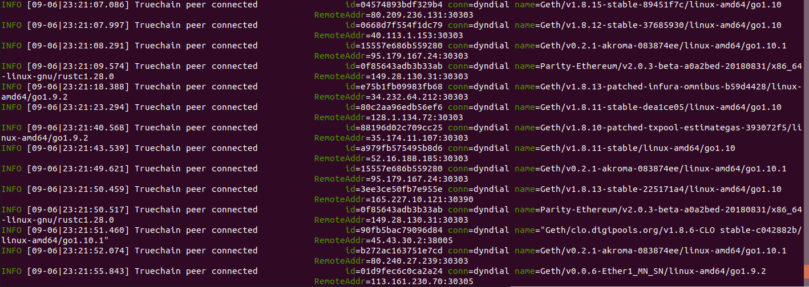

# True链开发实战篇-主网网络搭建
###### 作者：程阳	审阅：

## 系统版本： Ubuntu 18.04

## 所需工具
1. Git
2. Go => version 1.7 或更高版本
3. 编译工具

## 安装Git
```
$ sudo apt-get install git
```

## 安装Go
```
$ sudo apt-get install golang-go
```

设置环境变量：
先创建GOPATH文件夹
```
$ cd ~
$ mkdir go
$ cd go
$ mkdir bin pkg src
```

在$HOME/.profile 文件的最后添加下边的命令
```
export GOPATH=$HOME/go
export PATH=$PATH:/usr/local/go/bin:$GOPATH/bin
```
然后运行以下命令使之生效
```
$ source $HOME/.profile
```

测试是否安装成功：

将如下代码写入$HOME/go/src/hello/hello.go

```
package main

import "fmt"

func main() {
	fmt.Printf("hello, world\n")
}
```

然后编译运行：
```
$ cd $HOME/go/src/hello
$ go build
$ ./hello		// 输出：hello,world
```

## 安装编译环境

```
$ sudo apt-get install build-essential
```

## 编译 TrueChain

进入一个你喜欢的目录，比如$GOPATH/src/ ，运行下面的命令
```
$ cd $GOPATH/src/
$ git clone https://github.com/truechain/truechain-engineering-code.git
```

下载完成后进入truechain-engineering-code目录：
```
$ make getrue    // 只编译getrue
或者
$ make all    // 编译所有工具
```

编译成功后的可执行文件在 build/bin/ 目录下，运行以下命令可查看getrue版本信息
```
$ ./getrue version
```

为了getrue命令在任意文件夹下都可以运行，需要以下操作

```
$ cp path/getrue $GOPATH/bin
```

** 以上安装过程如有疑问请参考(Ubuntu环境搭建)[https://github.com/truechain/wiki/blob/master/developer/3-1.Ubuntu_env_build.md] **

## 运行主链

直接运行以下命令，就开始连接其他Peer，然后自动同步区块了：
```
 ./build/bin/getrue  --datadir ./data  --cache 4096 --rpc --rpcport 33333 --rpcaddr 0.0.0.0
```

> 参数视个人情况而加，直接运行``` getrue --datadir path/data ```也是可以跑起来的

命令中的几个参数需要解释：
- --datadir "xxxx" 指定数据目录，用来存放区块链数据，状态数据，keystore数据等。这个目录占用空间是比较大的，指定的目录要有足够的磁盘空间。
- --cache value 分配给内部缓存的内存MB数量，默认为 128，最后设置大一点儿，起码 1024吧，这个值设大一些可以提高数据同步效率。
- --rpc 启用HTTP-RPC服务器
- --rpcaddr HTTP-RPC服务器接口地址(默认值:“localhost”)，默认只允许本地连接，设置为 0.0.0.0 可以接收任何地址发来的连接请求
- --rpcport HTTP-RPC服务器监听端口(默认值:8545)，可以改为不同的端口

运行的时候大概是这个样子：


过一会自动同步区块

然后就经历漫长的等待吧，等区块同步完成的时候，该节点就可以接收交易请求了。


参考文献：
1. https://www.jianshu.com/p/719a34fe484d
