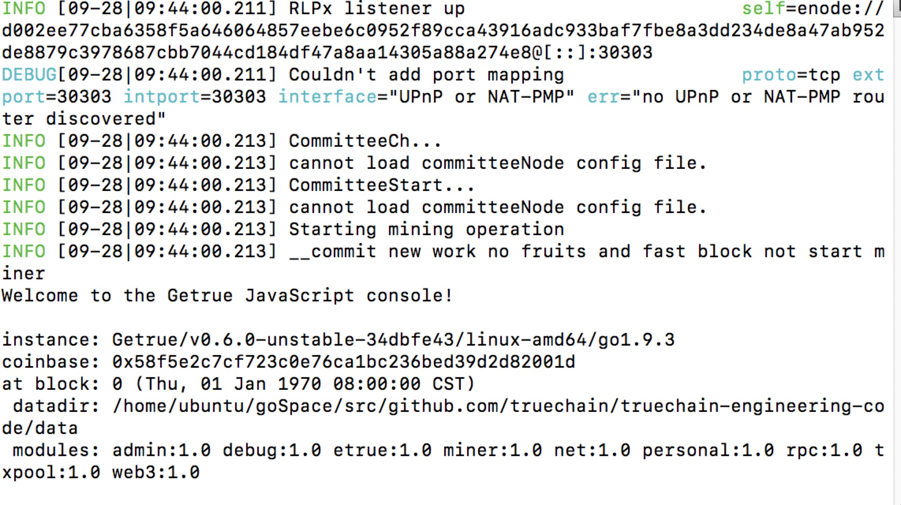
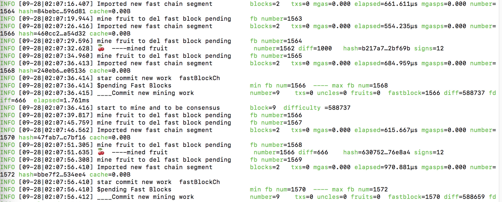
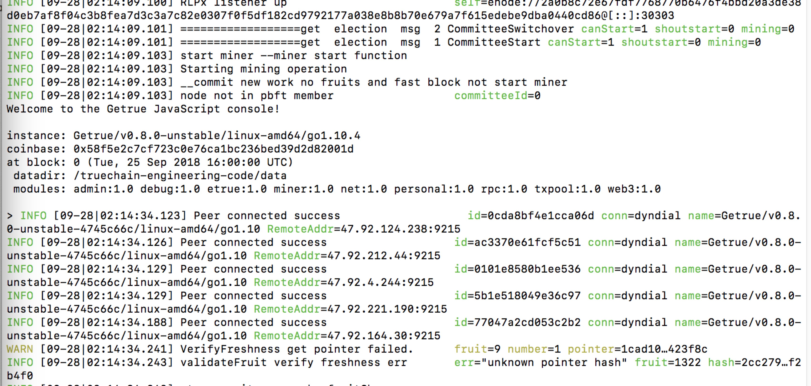

# TrueChain挖矿教程（docker版）

## 安装docker

ubuntu参考https://blog.csdn.net/bingzhongdehuoyan/article/details/79411479.   
Mac参考https://blog.csdn.net/jiang_xinxing/article/details/58025417. 
Windows参考http://www.runoob.com/docker/windows-docker-install.html. 

## 启动docker
`
service docker start
`
## pull初链镜像
`
docker pull registry.cn-hangzhou.aliyuncs.com/truechain_space/truechain_image:latest
`
## 更改镜像tag为getrue
`
docker tag registry.cn-hangzhou.aliyuncs.com/truechain_space/truechain_image getrue
`
## 创建config文件

1.创建truechain目录
 mkdir truechain
2.进入目录
 cd truechain
3.创建config文件，根据自己的需求配置。
 1)参与委员会竞选
 vi config
 将以下修改好的文件复制到config文件中

```
[Etrue]
EnableElection = true  
Host = "124.251.110.179"//将ip地址改成本机的外网ip  
Etherbase = "0x58f5e2c7cf723c0e76ca1bc236bed39d2d82001d"//此处为挖矿地址，切记设置改成自己的账户地址。  

```

2）非参与委员会竞选节点，只选择挖矿
 vi config
 将以下修改好的文件复制到config文件中

```
[Etrue]   
Host = "124.251.110.177"//将ip地址改成本机的外网ip     
Etherbase = "0x58f5e2c7cf723c0e76ca1bc236bed39d2d82001d"//此处为挖矿地址，切记设置改成自己的账户地址。  
  

```

## 启动节点自动挖矿
启动挖矿的命令，根据节点的需求选择

### 参与委员会竞选节点挖矿

1.进入truechain目录下，启动自动挖矿，根据节点需求启动命令。

1）挖矿只挖水果

```
docker run -v $PWD:/truechain-engineering-code -it -p 30311:30311 -p 30310:30310 -p 30303:30303 -p 9215:9215 getrue --datadir /truechain-engineering-code/data --config /truechain-engineering-code/config --testnet --mine  --minefruit --election console
```





2）挖矿水果和区块

```
docker run -v $PWD:/truechain-engineering-code -it -p 30311:30311 -p 30310:30310 -p 30303:30303 -p 9215:9215 getrue --datadir /truechain-engineering-code/data --config /truechain-engineering-code/config --testnet --mine --election console
```
2.解析命令

-p 将容器中的端口映射到宿主机
--datadir 数据存储的文件夹
--minefruit 指定挖矿只挖水果
--election 本节点参与委员会竞选


### 非参与委员会竞选节点挖矿

1.进入truechain目录下，启动自动挖矿，根据节点需求启动命令。

1）挖矿只挖水果

```
docker run -v $PWD:/truechain-engineering-code -it -p 30311:30311 -p 30310:30310 -p 30303:30303 -p 9215:9215 getrue --datadir /truechain-engineering-code/data --config /truechain-engineering-code/config --testnet --mine --minefruit console
```



2）挖矿水果和区块

```
docker run -v $PWD:/truechain-engineering-code -it -p 30311:30311 -p 30310:30310 -p 30303:30303 -p 9215:9215 getrue --datadir /truechain-engineering-code/data --config /truechain-engineering-code/config --testnet --mine console
```

2.解析命令

-p 将容器中的端口映射到宿主机
--datadir 数据存储的文件夹
--minefruit 指定挖矿只挖水果
--election 本节点参与委员会竞选


## 进入节点控制台

1.查询挖矿的coinbase地址：etrue.coinbase

2.查询账户余额：etrue.getBalance("账户地址")//账户地址就是自己的挖矿地址

3.停止挖矿：miner.stop()

4.控制台重新启动挖矿，括号内可以添加数字，表示开启几个线程：miner.start()

5.退出控制台并推出程序：exit


