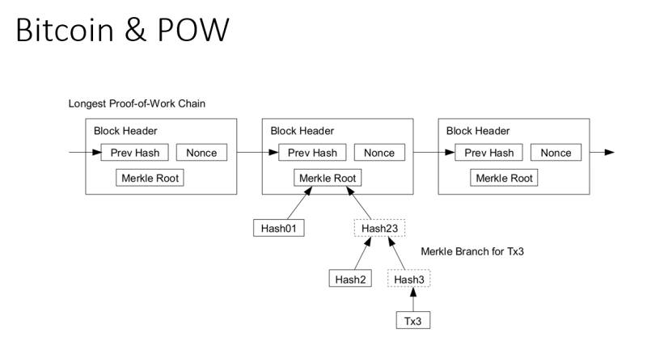

# 从pow到pos,再到pow+pbft

## 摘要

&emsp;&emsp;共识机制一直都是区块链系统的核心，现有区块链系统中常用的共识机制有：POW、POS、DPOS、PBFT等几类。本文将讨论POW算法，POS的两种实现，和truechain中用到的POW+PBFT算法。

## POW简介

- **图解**

	&emsp;&emsp;block，通过hash来连接，下一个block可以找到上一个；，block中txs的merkle树根写在header里；节点需要算一个目标值，目标值则是将这个块header(根据POW不同的实现header中可能还会有其它更多字段)和一个随机数算一个hash，如果满足前N位为零，则表示他是一个合法的块。当出块成功后，节点通过coinbase交易，根据共识协议的规定给自己打N个币作为奖励。

- **优点**

	&emsp;&emsp;在系统运行的过程中，各节点通过算力来进行投票，不是所有人都能生产block，节点需要通过付出硬件、算力作为挖矿的成本，足够的去中心化，能保证系统的安全运行

- **缺点**

	&emsp;&emsp;1. 耗电，现在比特币挖矿的消耗相当于整个丹麦国家的用电量；2. 算力集中，曾经是CPU挖矿，但是随着ASIC出现，使得算力越来越集中在专业的挖矿团队手里；3、51%攻击的问题

&emsp;&emsp;从POW得到启发，也为了解决POW中的一些潜在的问题，就出现了POS的想法。共识算法的本质是为了在分布式系统中各节点取得一致性，能用算力挖矿那也能用币来挖矿。

## POS
### POS之Peercoin
&emsp;&emsp;第一个使用POS的系统是Peercoin,Peercoin是一种Chain-base-style POS。  
&emsp;&emsp;POS中block的生产者发起一笔coin stake transaction自己给自己转币，coin stake证明了你有币，是系统利益的相关者。

&emsp;&emsp;Peercoin中挖矿算法为  
 proofhash < coins \* age \* target; target类似于比特币的难度调整,proofhash为一个目标值，其它和POW一个意思算力大的挖到矿的概率更大，当币被用于挖矿后其coinage会归零重新累积，则系统可以定义消耗coinage最多的链为最长链。

&emsp;&emsp;作为一个最早的pos系统，存在很多严重的缺陷，如：懒节点、nothing at stake、long range attack等；

在后续的一些POS项目中，针对以上的两种情况进行了一些改良，比如引入惩罚机制解决了nothing at stake 问题；引入弱主观的概念，某种程度上解决了long range attack问题。

### POS之TenderMint  

&emsp;&emsp;TenderMint是一个BFT-based PoS，区块的确认在block的粒度上而非chain的粒度，producer会一直进行投票，直到把一个block选举出来，然后去选择下一个区块。在tendermint里，有一些validator，他们是通过bond transaction使自己的一些币进入stake状态。这些validator有权利去进行proposal来选择区块。投票之后，他们可以unbond transaction将币提出来，退出validator的角色。在一轮内部，validator可以通过vote，签名一个消息来广播达成共识，通过多轮的投票来决定一个block是不是OK的。在vote的时候，一个block不断会进入下一个状态，如果有2/3的多数认为它可以，它则可以进入下一轮。  

&emsp;&emsp;Bond的好处,是引入了处罚机制，有了bond,一个producer必须把coin stake起来,如果一个validator被发现在投了不同的区块时，则他的coin会被没收,这样既解决了nothing at stake的问题；

&emsp;&emsp;BFT-based PoS的问题：因为没有最长链的概念，完全根据当前的状态推断下一个状态是否可靠。之前的long range attack会变成另外一个问题，当一个节点offline一段时间或者第一次加入网络时会无法知道该加入哪个chain,为了解决这样的问题，引入了weak subjective，通过第三方来check选择主链，只需check一次；

## pow+pbft

### pbft简介
&emsp;&emsp;1982有几个学者提出了拜占庭将军问题，用将军打仗的比喻，来解释这个共识的问题。[《The Byzantine Generals Problem》](https://people.eecs.berkeley.edu/~luca/cs174/byzantine.pdf)
&emsp;&emsp;1999年有一篇文章[《Practical Byzantine Fault Tolerance》](http://pmg.csail.mit.edu/papers/osdi99.pdf)讲了实用的拜占庭容错的方法。但是此时，PBFT的应用也仅仅在局部高速的系统上有所实践，没有太多的应用场景。

&emsp;&emsp;初链是一个基于混合共识的公链，在去中心化与高效性之间取得了不错的平衡；通过pow算法来选举委员会，委员会内部通过PBFT算法进行决策，从而使整个系统达到共识；内部通过stake_in交易来冻结委员会成员财产，来防止成员作恶；  

###### 问题：  
&emsp;&emsp;1、懒节点，当一个委员会运行良好时，将不会频繁的进行委员会成员选举和切换，非委员会成员将会失去在线的动力；
&emsp;&emsp;2、算力过于集中，通过POW容易造成自力集中，是否会产生51%攻击类的问题；  
&emsp;&emsp;3、电力资源浪费；

## 总结

&emsp;&emsp;POW、POS及PBFT都是非常复杂的问题，他们的安全性、性能，整个社区都在研究过程中。以上仅是个人一些小的看法和总结，仅供参考！

## 参考
-truechain whitepaper  
-truechain yellowpaper
-peercoin whitepaper  
-Proof of Stake FAQ  
-tendermint whitepaper  
