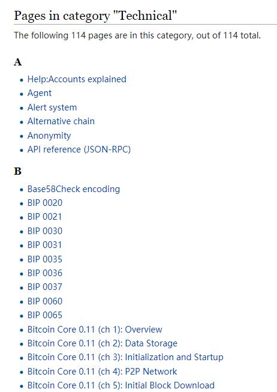

# TrueChain英文知识库项目- 头脑风暴

随着9月TrueChain主网的上线，英文Wiki将会是开发者社区非常重要的指导性文档。因此，特成立此项目组，进行TrueChain英文知识库的建设。

## 1 项目概况
项目：初链知识库（wiki）
项目经理：Brian

项目核心成员：
-	技术专家：陈大宏，刘洋，田明
-	网站开发：李建
-	Rick

**项目目标：开发一个英文的初链知识库，配合主网上线（参考：https://developers.mixin.one/api#apicreate_pin）**

项目重要节点：
**Milestone 1: 9月20日**，初链主网上线。

目标：wiki框架搭建完成，为后续初步添加内容打下基础

项目工作模式：
-	总体的内容规划。就是目录结构由Brian负责统筹
-	细节内容，由刘洋、田明等技术专家来补充，也包括社区内可以利用的资源
-	具体的翻译或者英文wiki写作，可以通过利用现有初链开发者社区，用按S级任务模式发布，按工作时长来计算奖励。具体步骤和计划。以及社区内的内容编辑人员，Brian负责统筹
-	大宏，Rick提供指导和必要的支持

第一次迭代（截止：9月20日）主要工作计划：
-	确定英文wiki总体规划和一级目录结构
-	确定第一阶段开发的内容
-	招募社群兼职人员，高质量完成wiki网站对以上内容的呈现
-	确定后续迭代的目标

## 2 第一次迭代 -- 英文知识库头脑风暴
### 2.1 英文知识库的需求
目前收集到一下需求：
> 来自：Dr Z （张翰）

目前我们需求大致上是这样，三个主要页面：
1) 列出已有成果的页面:

2) 列出未来reserach topic的页面：

3) 列出on-going discussion的页面
on going discussion 大致象维基百科那样的模式，任何人都可以修改，但必须要达到一定标准（例如，信息出处），否则 moderator 不给通过。

### 2.2 对英文知识库目录和第一阶段入手点的想法
> 来自：陈大宏
第一阶段可以从web3的API入手

